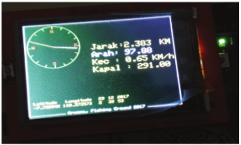

# tracking-fishing-ground-arduino
tracking fishing ground using arduino and TFT LCD

this is my old project with geodetic student in 2017. This prototype is purpose for tracking fishing ground using GPS that is controlled by arduino and TFT LCD display.

